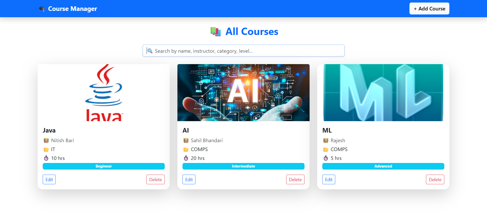

# 🎓 Course Manager (MERN Stack)

A full-stack Course Management application built using the MERN stack.
This app allows users to manage courses with full CRUD operations and search functionality, along with a clean and responsive UI.

---

## 🚀 Features

* ➕ Add new courses
* 📚 View all courses
* ✏️ Edit course details
* ❌ Delete courses
* 🔍 Search courses by name, instructor, category, or level
* 🖼️ Display course thumbnail (via image URL)
* 📱 Responsive design using Bootstrap

---

## 🛠️ Tech Stack

### 🔹 Frontend

* **React.js** → Component-based UI development
* **Axios** → API communication between frontend & backend
* **React Router DOM** → Client-side routing
* **Bootstrap** → Responsive UI and styling

### 🔹 Backend

* **Node.js** → Runtime environment for server-side JavaScript
* **Express.js** → Web framework for building REST APIs
* **MongoDB** → NoSQL database for storing course data
* **Mongoose** → ODM for MongoDB (schema & queries)
* **CORS** → Enable cross-origin requests
* **Express Session** → Session handling (for future auth support)
* **BcryptJS** → Password hashing (for future authentication)

---

## 📁 Project Structure

```id="f2l7p9"
Course_Manager/
 ├── Frontend/
 │    ├── src/
 │    │    ├── components/
 │    │    ├── App.jsx
 │
 ├── Backend/
 │    ├── controllers/
 │    ├── models/
 │    ├── routes/
 │    ├── app.js
 │    ├── db.js
```

---

## ⚙️ Installation & Setup

### 1️⃣ Clone Repository

```id="8tf7lb"
git clone https://github.com/YOUR_USERNAME/course-manager-mern.git
cd course-manager-mern
```

---

### 2️⃣ Install Dependencies

#### Backend

```id="iqrw3v"
cd Backend
npm install
```

#### Frontend

```id="o5n0cd"
cd Frontend
npm install
```

---

### 3️⃣ Run Project

#### Start Backend

```id="o7f6k3"
nodemon app.js
```

#### Start Frontend

```id="8nq8u9"
npm run dev
```

---

## 🌐 API Endpoints

| Method | Endpoint    | Description       |
| ------ | ----------- | ----------------- |
| GET    | /course     | Get all courses   |
| POST   | /course     | Add a new course  |
| GET    | /course/:id | Get single course |
| PUT    | /course/:id | Update course     |
| DELETE | /course/:id | Delete course     |

---

## 📸 Screenshot

<p align="center">
  
</p>

---

